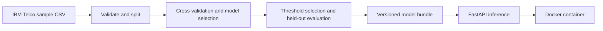

# Telco Customer Churn: Reproducible Training and Model Serving

An end-to-end machine learning project that predicts customer churn from account and service details. It compares a baseline with three classifiers, preserves preprocessing and the selected decision threshold with the fitted model, and serves predictions through a validated HTTP API. The repository includes a tested model snapshot and a Docker image definition for reproducible serving.

## Highlights

- **Leakage-aware evaluation:** stratified training, validation, and test partitions; preprocessing fitted inside each cross-validation fold.
- **Reproducible runs:** dataset hash, split manifest, package versions, model parameters, metrics, and charts saved for every training run.
- **Consistent inference:** the saved bundle contains raw-input cleaning, learned preprocessing, the classifier, and its decision threshold.
- **Deployable API:** FastAPI validates requests and returns the score, decision, threshold, and model name.
- **Container verification:** GitHub Actions runs unit tests and builds and smoke-tests the Docker image.



## Results

The selected XGBoost model was trained on 7,043 fictional customer records. Candidate ranking used training-fold average precision. The decision threshold was selected on validation data, then the fixed pipeline and threshold were evaluated on 1,409 test rows.

| Candidate | Mean training CV average precision |
| --- | ---: |
| XGBoost | 0.671 |
| Logistic Regression | 0.665 |
| Random Forest | 0.650 |
| Prior baseline | 0.265 |

| Held-out test metric | Value |
| --- | ---: |
| Average precision | 0.660 |
| ROC-AUC | 0.845 |
| Precision | 0.539 |
| Recall | 0.749 |
| F1 | 0.627 |

The selected threshold is `0.325706`. Scores are **not calibrated probabilities**. See the [model card](model/MODEL_CARD.md) for provenance and limitations.

## Run the API with Docker

Docker is required for these commands. The image includes the selected model, so the dataset is not needed to serve predictions.

```bash
docker build -t telco-churn-api .
docker run --rm -p 8000:8080 telco-churn-api
```

In another terminal, check the service and score the sample customer:

```bash
curl http://127.0.0.1:8000/health
curl -X POST http://127.0.0.1:8000/predict \
  -H "Content-Type: application/json" \
  --data-binary @sample_customer.json
```

The sample response contains `churn_score` near `0.754398` and `predicted_churn` of `Yes`. The score exceeds the saved threshold. API documentation is available at `http://127.0.0.1:8000/docs` while the container is running. Invalid requests receive HTTP 422.

## Train and evaluate

The source dataset is IBM's [Telco Customer Churn sample](https://github.com/IBM/telco-customer-churn-on-icp4d/blob/master/data/Telco-Customer-Churn.csv). The expected SHA-256 is `16320c9c1ec72448db59aa0a26a0b95401046bef5d02fd3aeb906448e3055e91`. Download it as `Telco-Customer-Churn.csv` in the project root. The dataset and generated training runs are ignored by Git.

Use Python 3.12 in a virtual environment, then run:

```bash
python -m pip install -r requirements.txt
python telco_churn.py
python -m unittest discover -s tests -t . -v
```

The training command prints its new `artifacts/<run-id>/` directory. It writes the fitted `churn_model.joblib`, `metrics.json`, `model_comparison.csv`, `split_manifest.json`, and evaluation charts. Set `CHURN_MODEL_PATH` to that bundle to serve a newly trained model. The model in `model/` is an explicitly selected snapshot for the container; generated runs are never selected automatically.

To score a CSV with a new bundle:

```bash
python predict.py --model artifacts/<run-id>/churn_model.joblib \
  --input new_customers.csv --output predictions.csv
```

Only load joblib models from trusted sources; deserializing them can execute code. The versioned model snapshot and its checksum are described in the [model card](model/MODEL_CARD.md).

## Project layout

```text
churn/                    Feature validation, pipelines, metrics, and charts
telco_churn.py            Training and evaluation command
predict.py                Batch CSV inference
api.py                    HTTP request contract and prediction endpoint
model/                    Selected model snapshot and model card
Dockerfile                Container image for serving
.github/workflows/ci.yml  Unit tests and container smoke test
tests/                    Regression tests
```

## Evaluation design and limitations

The training split fits the models and their preprocessing. Five-fold cross-validation ranks a prior baseline, Logistic Regression, Random Forest, and XGBoost. Validation data selects the threshold that maximizes F1, with ties going to the higher threshold. The test partition measures the fixed pipeline and decision rule. Customer IDs and target labels never enter the predictors.

The dataset has no event timestamps, so this evaluation cannot establish performance on future customers. The test data has been used during project development, which limits its independence as an estimate. A real retention program needs fresh validation, score calibration, a threshold based on intervention costs, and monitoring for data and performance changes.
